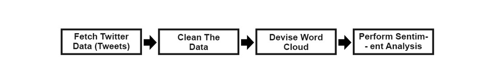

# Twitter_Sentiment_Analysis
Performing Sentiment Analysis on Tweets Extracted from Twitter API

Twitter is one of the biggest social media platforms out there with approximately 300 million registered users worldwide. On average, over 6000 tweets are sent out every single second which corresponds to over 350,000 tweets per minute. These tweets come from a variety of sources and can vary when it comes to the subject and context. However, each tweet shares a common trait – an opinion that is no longer than 280 characters. Each trend is represented by a hashtag, and each hashtag includes a stream of reiterating tweets.

The goal of our sentiment analysis project is to fetch tweets belonging to the hashtag chosen by the user and determine the number of people that are in favor or against the subject in question. This knowledge can further be applied to improve a business’s functioning, and/or predict trends and products that users may be interested in. The information gained can also be applied to launch campaigns tailored to a targeted audience.

## Abstract

In this project, Twitter will be used to source tweets based on topics that are popular on the platform or user input using Python and a Twitter Developer Account. Additionally, we will clean and process the data in order to analyze the popular search terms from related topics. To do this, we will create a word cloud plot of key terms relevant to the search topic in order to identify the key phrase, and then conduct a sentiment analysis in order to ascertain how the general public feels about the subject.

## Resources Used

To complete the project we have leveraged following resources:
- Python
-	Natural Language Processing (NLP)
-	TweePy
-	TextBlob
-	Twitter API

## Project Flow

- Retrieve Twitter Data: Retrieve Twitter tweets and save them in a data frame.
- Clean Up The Data: To make tweets easier to work with, remove unused and redundant data.
- Create a Word Cloud: With TextBlob, create a word cloud to identify the top 20 trends in the subject at hand.
- Conduct a sentiment analysis to ascertain whether the general public's attitude is Positive, Neutral, or Negative.

## Project Outcome

To test the code and review the outcome, I considered reviewing people’s sentiments about Canadian Economy in 2023. The Top 20 words that were part of 100 most recent tweets relate to the topic includes:

1.	Canadian
2.	Economy
3.	2023
4.	Jobs
5.	Uncertainty
6.	Number 104000 which refer to the 104000 new jobs that has been created etc.

The following Count Bar Plot lists additional Top 20 words:

As part of the project, a Word Cloud is generated from the Unique Tweets. The World Cloud also reflects similar top words as the Bar Plot above:

1.	Canadian
2.	Economy
3.	Job
4.	Clears
5.	Uncertainty
6.	Rebound etc.

Below is the snippet of the Word Cloud for reference:

Further, sentiment analysis was performed on the Tweets using Textblob library to generate Polarity and Subjectivity for each tweet. Polarity of the tweet was used to generate sensitivity flag  - Positive, Neutral or Negative. Given below is result of sentiment analysis:

To grasp more clarity on the sentiment of the Topic for search, a scatter plot was created validate the bar count plot.

